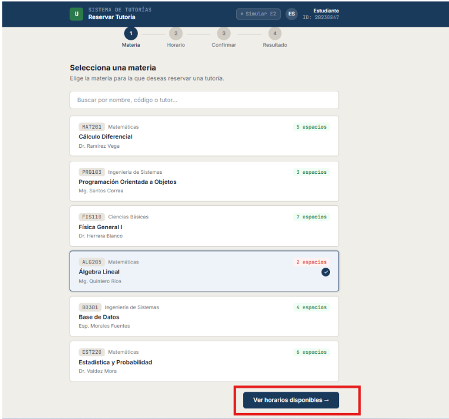
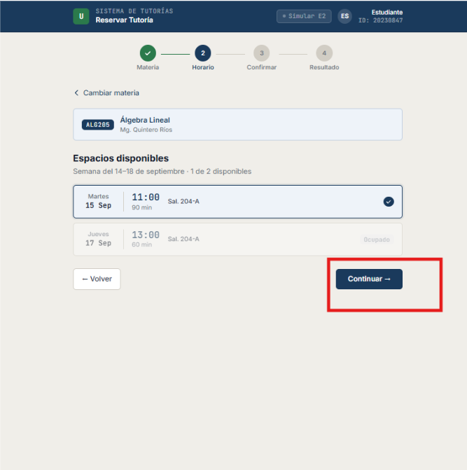
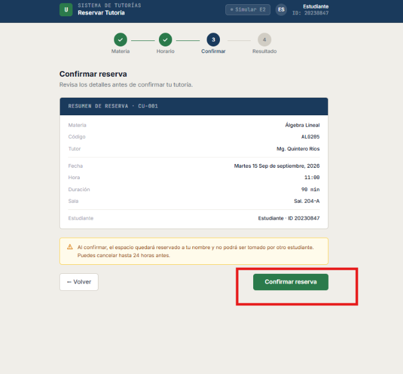
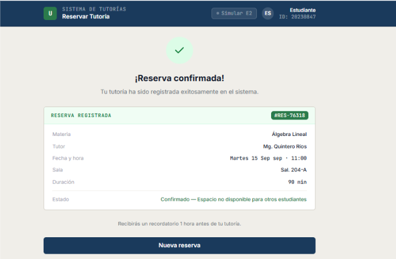

# Prototipo CU-001: Reservar tutoría

El siguiente prototipo representa el flujo principal para reservar una tutoría.

## 1. Seleccionar materia

## 2. Seleccionar horario

## 3. Confirmar reserva

## 4. Reserva confirmada

